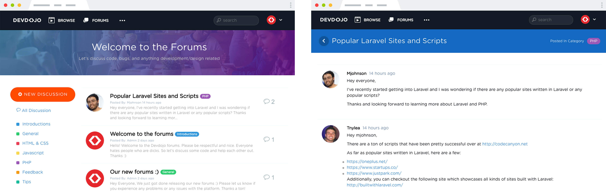

Aquí tienes el README reescrito sin enlaces externos, manteniendo el branding y la estructura profesional de **Innobox R&R**.

---

# 🗂️ **Innobox Forum - Laravel Forum Package**  
🚀 Un paquete poderoso y flexible para agregar foros a tus aplicaciones Laravel.

<p align="center"></p>

---

## 📌 **Instalación**

> ⚠️ **Nota:** Si este es un nuevo proyecto, asegúrate de instalar la autenticación de usuario predeterminada de Laravel ejecutando:  
> `php artisan make:auth`

1️⃣ **Instalar el paquete en tu proyecto**  
```bash
composer require "innoboxrr/forum=0.2.*"
```

2️⃣ **Registrar el Service Provider** *(Solo necesario en Laravel < 5.5)*
```php
Innoboxrr\Forum\ForumServiceProvider::class,
```

3️⃣ **Publicar los archivos de configuración y assets**  
```bash
php artisan vendor:publish --provider="Innoboxrr\Forum\ForumServiceProvider"
```

4️⃣ **Actualizar el autoload de Composer**  
```bash
composer dump-autoload
```

5️⃣ **Ejecutar las migraciones**  
```bash
php artisan migrate
```

6️⃣ **Cargar datos iniciales en la base de datos**  
```bash
php artisan db:seed --class=ForumTableSeeder
```

7️⃣ **Incluir CSS y JS en tu plantilla principal**  
Dentro de `master.blade.php` o `app.blade.php` añade lo siguiente:  

👉 **En el `<head>`**  
```blade
@yield('css')
```

👉 **Antes del `</body>`**  
```blade
@yield('js')
```

🔹 Ahora, visita `tusitio.com/forums` y ¡listo! 🎉

---

## 🔄 **Actualización del paquete**
1️⃣ Asegúrate de usar la última versión en `composer.json`:  
```json
"innoboxrr/forum": "0.2.*"
```

2️⃣ Ejecuta la actualización:  
```bash
composer update
```

3️⃣ Publica nuevamente los assets y configuración:  
```bash
php artisan vendor:publish --tag=forum_assets --force
php artisan vendor:publish --tag=forum_config --force
php artisan vendor:publish --tag=forum_migrations --force
```

4️⃣ Asegura que la base de datos esté actualizada:  
```bash
php artisan migrate
```

✅ ¡Tu foro ahora está actualizado!

---

## ✍️ **Edición de contenido**
Innobox Forum admite varios editores de texto para los mensajes.

📌 **Markdown (SimpleMDE)**
1. Cambia la configuración en `config/forum.php`:
   ```php
   'editor' => 'simplemde',
   ```
2. Instala la librería de soporte para Markdown:
   ```bash
   composer require graham-campbell/markdown
   ```

📌 **Trumbowyg**
1. Configura en `config/forum.php`:
   ```php
   'editor' => 'trumbowyg',
   ```
2. Asegúrate de incluir **jQuery >= 1.8**.

---

## ⚙️ **Configuración avanzada**
Al publicar los assets, se generará el archivo `config/forum.php`, donde puedes personalizar la configuración del foro según tus necesidades.

### 🔹 **Personalización de estilos**
Si deseas agregar estilos personalizados, puedes incluir tu propio CSS después del `@yield('css')` en tu plantilla:

```blade
@if(Request::is(Config::get('forum.routes.home')) || Request::is(Config::get('forum.routes.home') . '/*'))
    <link rel="stylesheet" href="/assets/css/forums.css">
@endif
```

### 🔹 **SEO: Títulos amigables**
Para mejorar el SEO de tu foro, agrega esto en el `<head>` de tu plantilla:

```blade
@if(Request::is(Config::get('forum.routes.home')))
    <title>Foro - Nombre de tu Sitio</title>
@elseif(Request::is(Config::get('forum.routes.home') . '/' . Config::get('forum.routes.category') . '/*') && isset($discussion))
    <title>{{ $discussion->category->name }} - Nombre de tu Sitio</title>
@elseif(Request::is(Config::get('forum.routes.home') . '/*') && isset($discussion->title))
    <title>{{ $discussion->title }} - Nombre de tu Sitio</title>
@endif
```

### 🔹 **Personalización de vistas**
Para modificar las vistas del foro, crea una carpeta en `resources/views/vendor/forum` y copia allí los archivos de vista que desees personalizar:

```
resources/views/vendor/forum/home.blade.php
resources/views/vendor/forum/discussion.blade.php
```

---

## 🔔 **Eventos y Hooks**
Innobox Forum proporciona eventos para personalizar el comportamiento del foro.

### **Eventos disponibles**
| Evento | Propiedades | Descripción |
|--------|------------|-------------|
| `ForumBeforeNewDiscussion` | `$request, $validator` | Antes de validar y crear una discusión |
| `ForumAfterNewDiscussion` | `$request, $discussion, $post` | Después de crear una discusión |
| `ForumBeforeNewResponse` | `$request, $validator` | Antes de validar y crear una respuesta |
| `ForumAfterNewResponse` | `$request, $post` | Después de crear una respuesta |

### **Ejemplo de uso en `EventServiceProvider.php`**
```php
protected $listen = [
    'Innoboxrr\Forum\Events\ForumBeforeNewDiscussion' => [
        'App\Listeners\HandleNewDiscussion',
    ],
];
```

En el listener, puedes acceder a los datos del evento:

```php
public function handle(ForumAfterNewDiscussion $event)
{
    // Acceder a la discusión
    $event->discussion;
    
    // Acceder al post
    $event->post;
}
```

---

## 📸 **Captura de pantalla**
<p align="center">
    
</p>

---

## 🏆 **Contribuye al proyecto**
Si deseas colaborar en el desarrollo de Innobox Forum, cualquier contribución es bienvenida. Revisa el código, reporta errores o sugiere mejoras.

---

🚀 **Innobox Forum** es un paquete diseñado para llevar la funcionalidad de foros a tu aplicación Laravel de manera rápida y eficiente. ¡Disfrútalo! 🎉